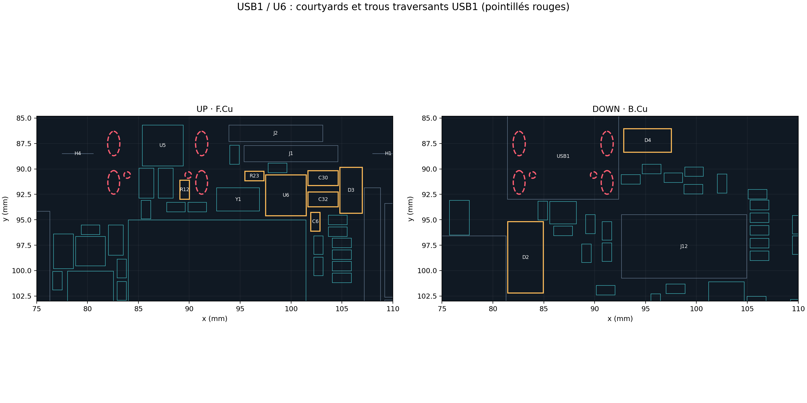

# FC_01 — correction USB1 / U6 et vias (28/09/2026)

La vérification précédente comparait les courtyards **sur une seule face**. Elle a manqué les trous traversants de USB1 sous des composants de F.Cu. Avant correction, les fixations GND de USB1 recouvraient les pads de D4 (`VBUS`, `+5V_SYS`) et C30 (`+5V_SYS`), et SH6 traversait le pad central de U6. Un trou non métallisé tombait aussi sous R12. Le PCB précédent n'était pas utilisable.

| Référence | Implantation corrigée | Raison |
|---|---|---|
| USB1 | Inchangé, B.Cu | Connecteur figé par Olivier. |
| U6 | F.Cu (99,50 ; 92,60), 180° | Libère SH6; sortie +3V3_SENS orientée vers C32. |
| C32 | F.Cu (103,15 ; 93,00), 0° | Découplage sortie U6 à environ 1,6 mm pad à pad. |
| C30 | F.Cu (103,15 ; 90,90), 0° | Écarte le pad +5V_SYS de SH4. **Sa distance de l'entrée U6 est d'environ 5 mm; la boucle d'alimentation reste à revoir au routage.** |
| C6, D3, R23 | (102,40 ; 95,20), (105,90 ; 92,10), (96,40 ; 90,70) | Dégagent la nouvelle emprise de U6 et de ses condensateurs. |
| D4 | B.Cu (95,20 ; 87,20), 180° | Ses deux pads ne recouvrent plus les fixations GND de USB1. |
| R12 | F.Cu (89,55 ; 92,05) | Dégage le trou de positionnement USB1. |
| D2 | B.Cu (83,20 ; 98,70), 90° | Dégage la fixation SH3 de USB1. |
| R41–R46 | Décalées de +0,80 mm en y | Dégagent le trou de montage H1. |

Les **26 vias préplacés** ont été supprimés : 22 vias GND périphériques et quatre autres vias de nets divers. Ils n'étaient reliés à aucune piste; les placer avant le routage créait une fausse impression d'avancement et pouvait gêner les nouvelles empreintes. Il reste **0 piste, 0 via et 2 zones cuivre**. Les vias GND utiles seront positionnés après routage et remplissage des plans.

## Contrôles effectués

- `python tools/verify_design.py` : 156 références, 562 couples broche/pad, aucune erreur de géométrie d'empreinte.
- `python tools/check_connectivity.py` : aucun conflit ni fusion des groupes de nets examinés; les bus MOTOR1–4 restent hors du parseur statique.
- `python tools/audit_placement.py --baseline <PCB initial>` : aucun recouvrement de courtyards sur une même face, keepout opposé de Y1 libre, 22 composants figés inchangés.
- `python tools/audit_through_holes.py` : aucun trou traversant d'une face n'intersecte le courtyard d'un composant de l'autre face dans le modèle 2D; aucun contact entre pad SMD et trou traversant détecté.

**Limites :** KiCad CLI n'est pas disponible ici. ERC, DRC natif, remplissage des zones, contrôle 3D du boîtier USB et vérification des dégagements de fabrication restent à faire. Le routage complet est absent. La distance C30–U6 et les liaisons VBUS/+5V_SYS, +3V3_SENS, GND et VCAP exigent une revue de placement/routage avant fabrication.
